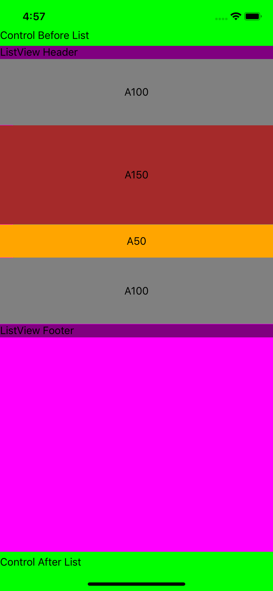
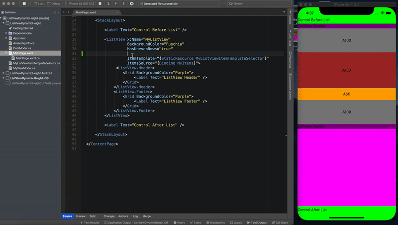

# xamarin-listview-dynamicheight

## ListView Height Issue

This sample demonstrates an issue with the Xamarin ListView control height, which is not adjusted to fit only items available in list. It takes all available space vertically without an ability to define proper vertical options.

```xaml
<ContentPage ...>
    <StackLayout>
        <Label Text="Control Before List" />
        <ListView x:Name="MyListView"
                HasUnevenRows="true"
                ItemTemplate="{StaticResource MyListViewItemTemplateSelector}"
                ItemsSource="{Binding MyItems}">
        </ListView>
        <Label Text="Control After List" />
    </StackLayout>
</ContentPage>
```



## Hot-Reload Issue

The following video also demonstrates an issue with the Hot-Reload when `VerticalOptions="Start"` is set in runtime. It loads the app with than option without any issues, but if you set the same option in runtime, then Hot Reload squeezes the ListView and cuts the Footer. Same thing happens even if my ListView is in the root of the page (no StackLayout), it just starts to occupy half of the page. It’s still scrollable and you can scroll all the way to the footer and can see it.

